# NLA Method Pipeline

Reproduction of [Natural Language Autoencoders](https://transformer-circuits.pub/2026/nla/) (Anthropic, 2026)
using **Qwen2.5-0.5B** in place of the paper's Qwen2.5-7B. Reference code: [kitft/natural_language_autoencoders](https://github.com/kitft/natural_language_autoencoders).

---

## Overview

The NLA consists of two jointly-trained models:

- **Activation Verbalizer (AV)**: takes a residual-stream activation h_l and generates a natural-language description z
- **Activation Reconstructor (AR)**: takes a description z and predicts the original activation h_l

Training is bootstrapped through two supervised warm-starts (one per model) before joint RL with GRPO. This document details the full pipeline as implemented, filling in steps the paper leaves implicit.

---

## Pipeline Diagram

```mermaid
flowchart TD
    subgraph S0["Stage 0 — Activation Extraction"]
        direction TB
        FW["FineWeb sample-10BT\nstreamed from HuggingFace\n~10 billion tokens"]
        TM["Target Model T\nQwen2.5-0.5B · frozen · bf16"]
        FW --> POS["Tokenise each document\nFilter: ≥ 150 tokens\nSample ≤ 10 positions / doc"]
        TM --> HOOK["Forward hook on layer 16\nextract residual stream h_l ∈ ℝ⁸⁹⁶\nat each sampled position"]
        POS --> HOOK
        HOOK --> DS0["activations/dataset/\n100 000 rows\ncolumns: text_truncated · activation"]
    end

    subgraph S1["Stage 1 — LLM Explanation Generation"]
        direction TB
        DS0 --> LF["Length filter\n≥ 400 chars  →  83 071 pass\n16 929 too short, skipped"]
        LF --> API["DeepSeek V4-Flash API\nconcurrency = 1 000\nresumable via checkpoint JSON"]
        API --> PROMPT["2–3 feature analysis prompt\n(reference codebase version)\nasks what the LM is 'thinking'\nat the truncation point"]
        PROMPT --> CLEAN["Response cleaning\nextract ＜analysis＞…＜/analysis＞\nstrip bold markers and bullets\nrequire ≥ 2 features or retry"]
        CLEAN --> DS1["activations/dataset/\n+ summary column\n(plain text, no tags)"]
    end

    subgraph S2["Stage 2 — AR Warm-Start  ✓ complete"]
        direction TB
        DS1 --> COL["ActivationDataset\n(summary, activation) pairs\n90 / 10 train / val split"]
        COL --> AR["Activation Reconstructor\nQwen2.5-0.5B layers 0..16\nfinal norm → Identity\nso last_hidden_state = raw h_l\n+ Linear(896→896, bias=False)\nidentity-initialised weight"]
        AR --> INP["Input prompt\nAR_PREFIX + summary + AR_SUFFIX\nlast-token hidden state → head → â"]
        INP --> LOSS2["MSE loss  ‖â − h_l‖²"]
        LOSS2 --> OPT2["AdamW · cosine schedule\nhead lr = 1e-4 · base lr = 1e-5\ngrad clip 1.0 · batch 32 · 30 epochs\n390 M trainable parameters"]
        OPT2 --> AR
        OPT2 --> CK2["checkpoints/ar_baseline.pt\nval FVE ≈ 0.43\n(paper target: 0.3–0.4)"]
    end

    subgraph S3["Stage 3 — AV Warm-Start  ⏳ pending"]
        direction TB
        CK2 --> AV["Activation Verbalizer\nQwen2.5-0.5B\nactivation h_l injected as soft token\nbefore the text prompt"]
        AV --> SFT["SFT on (h_l → text_truncated)\nteaches AV to produce text\nthat describes the activation\nbefore RL reward signal exists"]
        SFT --> CK3["checkpoints/av_warmstart.pt"]
    end

    subgraph S4["Stage 4 — Joint GRPO Training  ⏳ pending"]
        direction TB
        CK3 --> GRPO["For each h_l:\nAV samples G descriptions z₁…z_G\nAR reconstructs â_g from each z_g\nreward_g = cosine_sim(â_g, h_l)"]
        GRPO --> ADV["Group-relative advantage\nA_g = (reward_g − mean) / std\nno value-function baseline needed"]
        ADV --> UPD["AV update: GRPO policy gradient\nAR update: supervised MSE on AV output\nboth updated each step"]
        UPD --> OUT["Trained NLA\nAV + AR jointly optimised\neval: val FVE · description quality"]
    end
```



---

## Stage 0 — Activation Extraction

**Script:** `scripts/generate_data.py` · **Runner:** `scripts/run_generate_data.sh`

**What it does:**  
Streams the FineWeb sample-10BT corpus and runs Qwen2.5-0.5B in forward-only mode. A hook on layer 16 captures the residual-stream vector h_l at sampled positions within each document.

**Key decisions vs paper:**

| Aspect | Paper | This repo |
|---|---|---|
| Corpus | FineWeb sample-10BT | FineWeb sample-10BT ✓ |
| Target model | Qwen2.5-7B | Qwen2.5-0.5B (GPU budget) |
| Probe layer | ~20 (7B model) | 16 (0.5B model, ≈ 2/3 depth) |
| Positions/doc | 10 | 10 ✓ |
| Dataset scale | ~1M vectors | 100K (validate first) |
| Min context | not stated | 150 tokens (~500 chars) |
| Activation dtype | float32 | float32 ✓ |

**Output format:**  
HuggingFace Dataset saved to `activations/dataset/`:
- `text_truncated` — the text the model saw up to the extraction point  
- `activation` — float32 array of shape (896,) — the raw residual stream at h_l

**Activation statistics (100K run):**  
Norms roughly N(μ, σ) with no extreme outliers; no normalisation applied before storing.

---

## Stage 1 — LLM Explanation Generation

**Script:** `scripts/generate_summaries.py` · **Runner:** `scripts/run_generate_summaries.sh`

**What it does:**  
For each `text_truncated`, calls DeepSeek V4-Flash to generate a structured linguistic analysis of what the language model is "thinking about" at the truncation point. The analysis targets the information content of h_l — what patterns and constraints the model has built up — rather than summarising the text's topic.

**Prompt (2–3 feature version, from reference codebase `stage2_api_explain.py`):**  
Asks for the 2–3 most important features the language model would use to predict the next token, ordered by importance. The final feature must analyse the last token specifically. Format: `<analysis>…</analysis>` with ~80–100 words total.

> **Prompt version note:** The paper appendix specifies a 4–5 feature / 150–200 word prompt. The reference codebase uses the shorter 2–3 feature version. We use the reference version, as it matches the published experiments and is faster to generate.

**Response cleaning (mirrors reference `_extract_and_clean`):**
1. Extract content inside `<analysis>…</analysis>` — tags are **not** stored
2. Strip list-prefix markers (`-`, `*`, `•`, `1.`, etc.)
3. Strip `**bold**` markers
4. Strip stray `*` and `_` from line edges
5. Drop empty lines; rejoin with `\n\n`
6. Reject if fewer than 2 non-empty lines remain → retry (up to 4 attempts)

**Why cleaning matters:** DeepSeek (like Claude) naturally formats responses with bold headings and bullet points. Storing cleaned plain text means the AR prompt during training is consistent with what it will receive from the AV during RL — the AV should not need to learn to produce markdown formatting.

**Filtering and scale:**
- 16,929 samples (< 400 chars) skipped — too short for meaningful analysis
- 83,071 samples processed
- Throughput: ~87 it/s at concurrency=1000
- Runtime: ~16 minutes for 83K samples
- Checkpoint: `activations/summaries_checkpoint.json` — safe to interrupt and resume

**API provider note:**  
Paper uses Claude Opus 4.5. We use DeepSeek V4-Flash (~$4/100K vs ~$75 for Claude Opus). The reference codebase uses Claude Haiku (similar cost tier). Quality difference is unknown; structured prompting is followed well by DeepSeek.

---

## Stage 2 — AR Warm-Start

**Script:** `scripts/train_ar_baseline.py` · **Runner:** `scripts/run_ar_pretraining.sh`

**What it does:**  
Trains the Activation Reconstructor (AR) to map text descriptions → activations, using the LLM-generated `summary` column as a supervised signal. This establishes that the AR can decode text into h_l before RL begins. The FVE achieved here is the warm-start quality that the joint GRPO phase will try to maintain or improve.

**AR architecture:**
- Base: Qwen2.5-0.5B transformer body, truncated to layers 0..16
- Final norm replaced with `nn.Identity()` so `last_hidden_state` = raw residual stream (matching what the hook captured during Stage 0)
- Head: `nn.Linear(896, 896, bias=False)`, initialised as identity matrix
- Total trainable parameters: 390M (full model unfrozen)

**Why truncate the base?**  
A single linear head cannot invert the remaining 7 transformer layers (17–23) plus the final norm. Truncating to the extraction depth makes the model's own residual stream at layer 16 the output, which exactly matches what we're trying to reconstruct.

**Why identity init?**  
At initialisation, AR(z) = base(z)[:, -1, :] — i.e. the model just reads out its own last-token representation. This gives starting loss ~1.61 vs ~1.94 for random init, and avoids the head fighting against the base in early training.

**Input format:**  
`AR_PREFIX + summary + AR_SUFFIX` = `"Summary of the following text: <text>{summary}</text> <summary>"`  
The last-token hidden state at the position of the final `>` token is fed to the linear head.

**Training configuration:**

| Hyperparameter | Value |
|---|---|
| Head LR | 1e-4 |
| Base LR | 1e-5 (= head LR / 10) |
| Schedule | Cosine annealing → 0 over 30 epochs |
| Gradient clipping | 1.0 |
| Batch size | 32 |
| Epochs | 30 |
| val split | 10% |
| Loss | MSE: ‖â − h_l‖² |

**Result:** val FVE ≈ 0.43 (paper reports 0.3–0.4 as warm-start target).

**Diagnostic note on FVE:**  
FVE = 1 − E[‖h_l − â‖²] / E[‖h_l − h̄_l‖²]. This is identical to R² from statistics — it measures the fraction of variance in the activations explained by the model's predictions. FVE = 0 means no better than predicting the corpus mean; FVE = 1 is perfect reconstruction.

**Issues encountered:**
- Early runs used plain text summaries (topic summaries, not linguistic analyses) → FVE ≈ 0.0007, model had nothing to learn from
- LR of 2e-5 was too conservative; model barely moved over 10 epochs → raised to 1e-4
- Missing gradient clipping with 390M unfrozen params → added `clip_grad_norm_(..., 1.0)`

---

## Stage 3 — AV Warm-Start (pending)

**Script:** `scripts/train_warmstart.py`

**What it does:**  
SFT the Activation Verbalizer on (h_l → `text_truncated`) pairs. The AV receives the activation as a soft token prepended to its input and learns to generate the original text that produced that activation. Without this warm-start, the AV produces random text and the GRPO reward signal is pure noise.

**AV architecture:** TBD — Qwen2.5-0.5B with a learned projection from h_l into the embedding space as a prefix token.

---

## Stage 4 — Joint GRPO Training (pending)

**Script:** `scripts/train_grpo.py`

**What it does:**  
Jointly trains AV and AR using Group Relative Policy Optimisation. For each activation h_l:
1. AV samples G candidate descriptions z_1 … z_G
2. AR reconstructs â_g = AR(z_g) for each
3. Reward: r_g = cosine_sim(â_g, h_l)
4. Group-relative advantage: A_g = (r_g − mean(r)) / std(r)
5. AV updated via policy gradient weighted by A_g
6. AR updated via supervised MSE on the AV's outputs

GRPO avoids a learned value function by using the within-group reward mean as a baseline, which stabilises training.

---

## Execution Order

```bash
# Stage 0: extract activations (run once)
./scripts/run_generate_data.sh

# Stage 1: generate explanations (run once, resumable)
export DEEPSEEK_API_KEY=sk-...
./scripts/run_generate_summaries.sh

# Stage 2: AR warm-start
./scripts/run_ar_pretraining.sh

# Stage 3: AV warm-start (pending implementation)
# python scripts/train_warmstart.py

# Stage 4: joint GRPO (pending implementation)
# python scripts/train_grpo.py
```

---

## Divergences from Paper

| # | Aspect | Paper | This repo | Reason |
|---|---|---|---|---|
| 1 | Target model | Qwen2.5-7B | Qwen2.5-0.5B | 2× RTX 4090 (48GB) cannot fit 7B SFT (~84GB) |
| 2 | Probe layer | ~20 | 16 | Scaled proportionally (2/3 depth) |
| 3 | Dataset scale | ~1M vectors | 100K | Validate pipeline before scaling |
| 4 | Explanation model | Claude Opus 4.5 | DeepSeek V4-Flash | Cost (~$4 vs ~$75 per 100K) |
| 5 | Explanation prompt | 4–5 features, 150–200 words | 2–3 features, 80–100 words | Reference codebase version used |
| 6 | AR warm-start FVE | 0.3–0.4 | ~0.43 | Slightly exceeds paper target |
